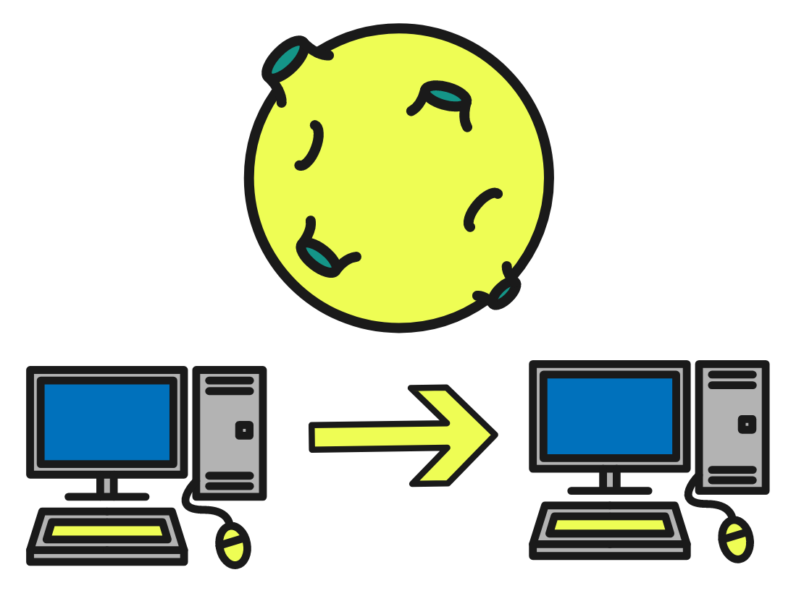

  

This is an example (backend only, no JS) web application written with the amazing
`lua-http` module. It is made without a framework. Instead I've used a few of my favorite
modules.

The website is a portal where one can register an account and write posts.
Posts can receive comments, be edited and deleted.
Users can change their password, display name and e-mail.

Sessions are handled via cookies and an internal sessions state. The application also has
csrf protection.

Everything is written as simple as possible and the code is pretty short.
Globals are used quite a bit, so that the state doesn't have to be pushed around via
function arguments (for the sake of simplicity).
The main file is called `server.lua`.

`lua-http` handles everything related to requests; `cqueues` allows the code to run
without blocking; `etlua` is used for template rendering; `pgmoon` talks to PostgreSQL;
`router` does the (you've guesed it) routing and `luafilesystem` checks for template modifications
for autoreloading (while developing).
